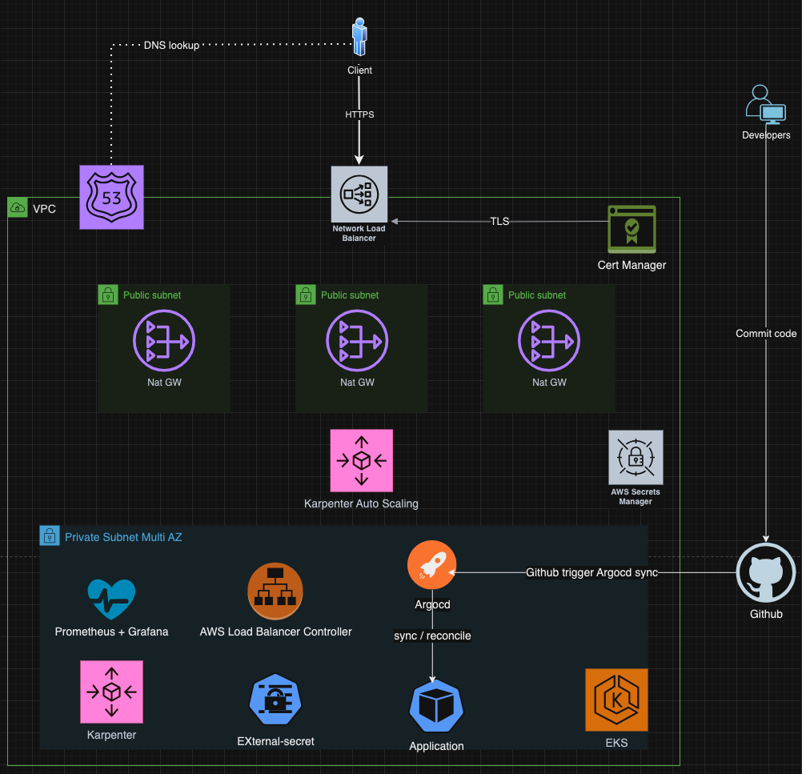

# Eks argocd deployment

## Disclaimer

> **Note:**
> This application is for demo purposes only and is **NOT ready** for production use. Please use it with caution and be aware that it is not suitable for real-world deployment at this stage.

## What will be deploy:
 - VPC
 - Public and private subnet
 - Nat gateway
 - Aws Cert Manager
 - Route53 
 - Aws Secret Manager
 - EKS cluster
 - Iam role for service accounts eks
 - Argocd
 - Karpenter
 - Aws load balancer controller
 - Aws ebs csi driver
 - External-secrets
 - Prometheus + Grafana (observability)

## System diagram


## Component explanation
### CICD
- [Repo application](https://github.com/thienchuong/podinfo)
  - Right after a PR is created. A CI will be trigger for run test and Sonar scan by calling file ci-go.yaml in [repo reusable-workflows](https://github.com/thienchuong/reusable-workflows)
  - If the PR is merged to main. A CI deploy will be trigger by calling file deploy-nonprod.yaml in [repo reusable-workflows](https://github.com/thienchuong/reusable-workflows) to auto release to EKS non prod env. The reusable-workflow then send payload to repo [argocd-apps](https://github.com/thienchuong/argocd-apps) and Argocd will handle the rest
  - flow: Repo application -> repo reusable-workflow -> repo argocd-apps -> argocd -> EKS
  
- [repo reusable-workflows](https://github.com/thienchuong/reusable-workflows)
  - This repo is used for prevent copying and pasting from one workflow to another
  
### Infrastructure
#### Deploy
- Download repo [infra](https://github.com/thienchuong/infra)
    ```
    git clone https://github.com/thienchuong/infra
    cd env
    ```
- For demo purpose, we can set AWS_ACCESS_KEY_ID and AWS_SECRET_ACCESS_KEY as env variable

    ```dotnetcli
    export AWS_ACCESS_KEY_ID=xxx
    export AWS_SECRET_ACCESS_KEY=xxx
    ``````
- apply
    ```
    terraform apply --auto-approve
    ```
- In reality we have to trigger the apply via github action workflow and Terraform cloud, which is implemented in this [workflow](https://github.com/thienchuong/infra/blob/main/.github/workflows/terraform-deploy.yaml)
#### Argocd
- Get kubeconfig
  ```dotnetcli
  aws eks update-kubeconfig --name eks-production --alias eks-production
  ``````

- Access Argocd by run command:
    ```
    kubectl port-forward svc/argo-cd-argocd-server 8080:443 -n argocd
    ```

- Get Argocd password from aws secret manager. Now you can see Argocd is holding Applications for addons (karpenter, Aws load balancer controller, External-secrets, Prometheus + Grafana, Aws ebs csi driver), ApplicationSet for deploy workload (podinfo)
- The addons are installed by this [terraform code block](https://github.com/thienchuong/infra/blob/main/env/prod/eks.tf#L120)

- After the application podinfo is synced, an ingress also created by aws alb controller. A TLS certfiticate is also fetched and deploy with the domain podinfo.thienchuong.xyz
- The workloads are installed by this [terraform code block](https://github.com/thienchuong/infra/blob/main/env/prod/eks.tf#L125)
- A helm chart for deploying application also created in [argocd-apps](https://github.com/thienchuong/argocd-apps/blob/main/.github/workflows/helm-release.yaml). We can update the chart and push to github OCI repository with versioning by leverage github action ci job

#### Karpenter
- For cost optimization auto scaling based on resource request

#### Aws alb controller
- For controlling how traffics are routed in EKS and certificate installation/termination
#### External-secret
- For secret management. A k8s secret will be created by external-secret by calling to aws secret manager and then the pod can consume the secret
#### Observability
- Prometheus + grafana + kube-state-metric + node-exporter + alertmanager are installed. 
- A simple rule for monitoring crashloopbackoff event and send alert to telegram. 
- Some grafana dashboards are included

### Limitation
- Not fully setup a production ready infra. Many component need to be fine turning and secret need to be controll
- Some Grafana dashboards is missing metric because of the resolution is a bit high and some label need to be relabel
- Deploy github action build cache to reduce the build time
- Deploy monitoring for github action build time
- Deploy github action runner controller for auto scaling the runners

### What CAN be improve but need to POC first
- Deploy thanos as a additional to observability stack for better performance and long time storage solution
- Deploy Hashicorp Vault as a replacement for aws secret manager for cost optimization
